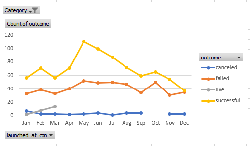

# Module 1 Challenge
1.	According to the scenario Louise estimates that her play will cost $12,000. 
As illustrated by Chart1, in this goal range $10000 to $15000 54,17% were successful, while in general 66,28% are successful.

The majority of campaigns, 889 from 1047 had smaller goals that they wanted to achieve, amounting in $9999 and less.
Louise should take this into account that her goal is slightly higher.

Assumption 1. I used the data in tab “Kickstarter” assuming that the amount for goal is listed in the same currency for all countries, so there is no need to exchange.
Assumption 2. There are no cancelled campaigns in this category, I assumed that it is not a mistaken data.

2.	From the Chart2 we found out that theater campaigns in general are successful if they launched in May and June and least favorable time to start new campaign would be December.
Louise should consider this important fact and launch her campaign in summer time.

3.	Louise should consider in which country the campaign will take place, and get more recent data about campaigns in this country.
Current dataset provides data only up to 2017. There are other factors to consider as well, such as global pandemic and restrictions imposed by the government.

